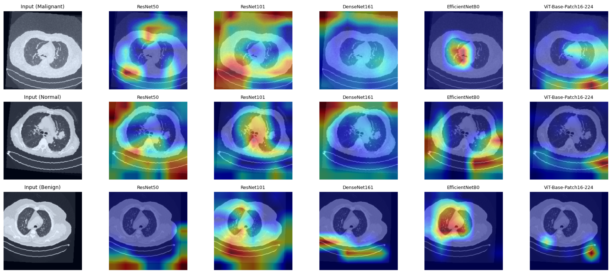

# GradCAM-Faith  
**Seeing Isn’t Always Believing: Evaluating Grad-CAM Faithfulness in Lung Cancer CT Classification**

<p align="center">
  <strong>Author:</strong> Teerapong Panboonyuen &nbsp;•&nbsp;
  <em>Accepted at 18th International Conference on Knowledge and Smart Technology (KST 2026)</em>
</p>

<p align="center">
  <a href="https://kst.buu.ac.th">
    
  </a>
  <a href="#">
    
  </a>
  <a href="#">
    
  </a>
  <a href="#">
    
  </a>
  <a href="#">
    
  </a>
</p>

<p align="center">
  
</p>

---

## 🧠 Motivation

Grad-CAM has become the *de facto* explainability tool for medical image analysis.  
But a critical question remains unanswered:

> **Do Grad-CAM heatmaps truly reflect the model’s reasoning — or are we just seeing convincing illusions?**

This repository accompanies our **KST-2026 accepted paper**, providing a **rigorous, quantitative evaluation of Grad-CAM faithfulness and localization reliability** across modern deep learning architectures for **lung cancer CT classification**.

---

## 📄 Paper

**Seeing Isn’t Always Believing: Analysis of Grad-CAM Faithfulness and Localization Reliability in Lung Cancer CT Classification**  
📍 *KST 2026 (Accepted)*

**Authors:**  
- **Teerapong Panboonyuen** (Chulalongkorn University, MARSAIL)

---

## 🚀 Key Contributions

✅ **Faithfulness-aware evaluation of Grad-CAM**  
✅ **Cross-architecture analysis** (CNNs vs Vision Transformers)  
✅ **Quantitative explanation metrics beyond visualization**  
✅ **Exposure of shortcut learning and misleading saliency**  
✅ **Clinical implications for trustworthy medical AI**

---

## 🏥 Dataset

We evaluate on the publicly available **IQ-OTH/NCCD Lung Cancer CT Dataset**:

- **1,190 CT slices**
- **110 patients**
- Classes:
  - Normal
  - Benign
  - Malignant
- Expert annotations by radiologists & oncologists

> ⚠️ All data are de-identified and ethically approved.

---

## 🧩 Models Evaluated

| Architecture | Type |
|--------------|------|
| ResNet-50 | CNN |
| ResNet-101 | CNN |
| DenseNet-161 | CNN |
| EfficientNet-B0 | CNN |
| ViT-Base-Patch16-224 | Transformer |

---

## 🔍 What Is *GradFaith-CAM*?

We go beyond pretty heatmaps.

### ✨ Faithfulness Metrics Introduced

1️⃣ **Localization Accuracy**
- Overlap between Grad-CAM maps and tumor regions

2️⃣ **Perturbation-Based Faithfulness**
- Drop in confidence when highlighted regions are removed

3️⃣ **Explanation Consistency**
- Stability across random seeds and model re-initializations

Together, these metrics answer a critical question:

> *Does the highlighted region actually matter for the prediction?*

---

## 📊 Key Findings

🔥 **Grad-CAM is NOT uniformly reliable**

- CNNs often produce **coarse or misleading attention**
- DenseNet shows signs of **shortcut learning**
- ViT provides **precise but sometimes non-faithful localization**
- High accuracy ≠ trustworthy explanation

> **Seeing a heatmap does not mean believing the model.**

---

## 🖼️ Visual Examples

<p align="center">
  
</p>

---

## ⚙️ Installation

```bash
git clone https://github.com/yourusername/GradFaith-CAM.git
cd GradFaith-CAM
pip install -r requirements.txt
````

---

## 🧪 Run Experiments

### Train a model

```bash
python experiments/train.py --config configs/resnet.yaml
```

### Evaluate Grad-CAM faithfulness

```bash
python experiments/evaluate.py --model resnet50
```

### Visualize explanations

```bash
python experiments/visualize.py --image sample.png
```

---

## 📌 Why This Matters

Medical AI does not fail loudly — it fails *convincingly*.

This work shows why **blind trust in saliency maps is dangerous**, and why explainability must be:

* Quantitative
* Model-aware
* Clinically grounded

---

## 📚 Citation

If you use this code, please cite:

```bibtex
@inproceedings{panboonyuen2026gradfaithcam,
  title     = {Seeing Isn’t Always Believing: Analysis of Grad-CAM Faithfulness and Localization Reliability in Lung Cancer CT Classification},
  author    = {Panboonyuen, Teerapong},
  booktitle = {Proceedings of the 18th International Conference on Knowledge and Smart Technology (KST)},
  year      = {2026}
}
```

---

## 🤝 Acknowledgements

This research was conducted at **Chulalongkorn University** and **MARSAIL (Motor AI Recognition Solution Artificial Intelligence Laboratory)**.

---

## 🧠 Final Thought

> **Interpretability without faithfulness is just another illusion.**

Let’s build AI we can truly trust.

---